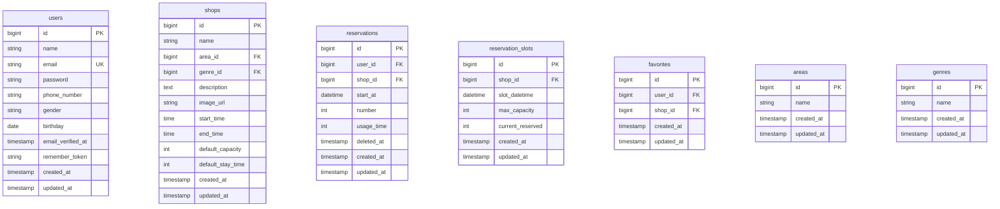

# lara-next-reserve

ある企業の「外部の飲食店予約サービスを使用する手数料を抑えたい」という要望に応えるために開発された、自社専用の飲食店予約システムです。

< --- トップ画面の画像 (docs-private/yoyaku_ui/shop_all.png) --- >

## 作成した目的
外部の飲食店予約サービスプラットフォームを利用することによる手数料コストを削減し、自社で顧客データや予約状況を一元管理できるシステムを構築するため。

## アプリケーションURL
*   **開発環境 (Frontend):** http://localhost:3000
*   **開発環境 (Backend API):** http://localhost
*   **メール確認 (Mailpit):** http://localhost:8025

※ 現在はローカル環境 (Docker) での動作を前提としています。

## 他のリポジトリ
本プロジェクトはモノレポ構成を採用しており、フロントエンドとバックエンドを一つのリポジトリで管理しています。

*   `laravel-next-app/`: バックエンド (Laravel)
*   `next-frontend-app/`: フロントエンド (Next.js)

## 機能一覧
*   **会員登録:** 名前、メールアドレス、パスワード等を入力して会員登録。
*   **ログイン/ログアウト:** メール認証機能付きのセキュアな認証。
*   **店舗一覧表示:** 全店舗を画像付きカード形式で一覧表示。
*   **店舗詳細表示:** 店舗の詳細情報と予約フォームを表示。
*   **店舗検索:** エリア、ジャンル、店名によるリアルタイム検索。
*   **予約機能:** 日付・時間・人数を指定して予約（在庫管理機能により重複予約を防止）。
*   **予約管理 (MyPage):**
    *   **予約状況:** 現在の予約確認とキャンセル機能（QRコード表示予定）。
    *   **予約履歴:** 過去の来店履歴の表示と、ワンクリック再予約機能。
    *   **設定:** お気に入り解除時の確認ダイアログの表示/非表示設定。
*   **お気に入り:** 店舗のお気に入り登録・削除と一覧表示。
*   **メール通知:**
    *   会員登録完了メール
    *   予約完了メール
    *   予約リマインダーメール（来店前日の朝に自動送信）

## 使用技術(実行環境)
*   **Docker / Docker Compose**
*   **Backend:**
    *   PHP 8.2
    *   Laravel 11
    *   MySQL 8.0
    *   Laravel Sanctum (SPA認証)
    *   Mailpit (メールテストツール)
*   **Frontend:**
    *   TypeScript
    *   Next.js 15 (App Router)
    *   Tailwind CSS
    *   Axios / SWR

## テーブル設計



## ER図


# 環境構築

Docker環境（Docker Desktop等）がインストールされていることを前提とします。

### 1. プロジェクトのクローン
```bash
git clone <repository-url>
cd lara-next-reserve
```

### 2. バックエンドのセットアップ
```bash
cd laravel-next-app

# 依存関係のインストール
docker run --rm \
    -u "$(id -u):$(id -g)" \
    -v "$(pwd):/var/www/html" \
    -w /var/www/html \
    laravelsail/php82-composer:latest \
    composer install --ignore-platform-reqs

# 環境変数の設定
cp .env.example .env

# コンテナ起動
./vendor/bin/sail up -d

# アプリケーションキー生成 & マイグレーション・シード実行
./vendor/bin/sail artisan key:generate
./vendor/bin/sail artisan migrate:fresh --seed
./vendor/bin/sail artisan storage:link
```

### 3. フロントエンドのセットアップ
別ターミナルで実行してください。
```bash
cd next-frontend-app

# 環境変数の設定
cp .env.local.example .env.local
# (必要に応じて .env.local 内の NEXT_PUBLIC_BACKEND_URL を編集)

# 依存関係インストール & サーバー起動
npm install
npm run dev
```

## テストの実行

本プロジェクトはPHPUnitを使用した自動テストを実装しています。

```bash
cd laravel-next-app
./vendor/bin/sail test
```

現在、以下の機能に対する機能テスト(Feature Tests)を完備しています（カバー率100%）。
*   認証・登録 (Authentication, Registration)
*   店舗一覧・詳細・検索 (Shop)
*   予約作成・キャンセル (Reservation)
*   マイページ機能 (MyPage)

## 開発用データ

### テストユーザー情報 (Seederで作成済み)
開発環境ですぐにログインして動作を確認できます。

*   **メールアドレス:** `user01@test.mail` (〜 `user03@test.mail`)
*   **パスワード:** `usertest`

```