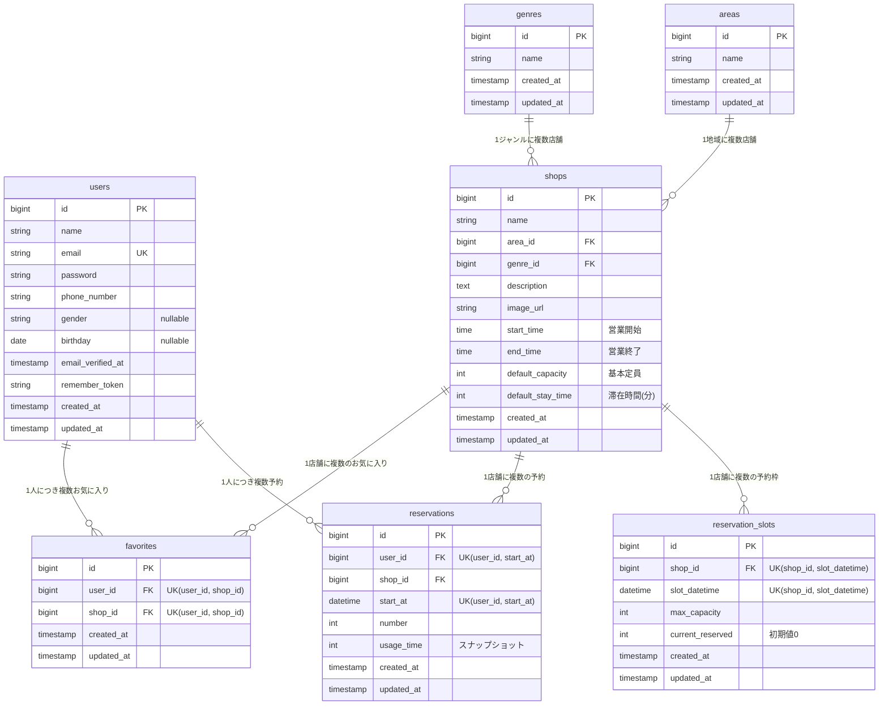

# ER図 (Entity-Relationship Diagram)

現在のデータベース構造を可視化したものです。在庫管理パターン（枠管理方式）を採用しています。

```mermaid
erDiagram
    users ||--o{ reservations : "1人につき複数予約"
    users ||--o{ favorites : "1人につき複数お気に入り"
    areas ||--o{ shops : "1地域に複数店舗"
    genres ||--o{ shops : "1ジャンルに複数店舗"
    shops ||--o{ reservation_slots : "1店舗に複数の予約枠"
    shops ||--o{ reservations : "1店舗に複数の予約"
    shops ||--o{ favorites : "1店舗に複数のお気に入り"

    users {
        bigint id PK
        string name
        string email UK
        string password
        string phone_number
        string gender "nullable"
        date birthday "nullable"
        timestamp email_verified_at
        string remember_token
        timestamp created_at
        timestamp updated_at
    }

    areas {
        bigint id PK
        string name
        timestamp created_at
        timestamp updated_at
    }

    genres {
        bigint id PK
        string name
        timestamp created_at
        timestamp updated_at
    }

    shops {
        bigint id PK
        string name
        bigint area_id FK
        bigint genre_id FK
        text description
        string image_url
        time start_time "営業開始"
        time end_time "営業終了"
        int default_capacity "基本定員"
        int default_stay_time "滞在時間(分)"
        timestamp created_at
        timestamp updated_at
    }

    reservation_slots {
        bigint id PK
        bigint shop_id FK "UK(shop_id, slot_datetime)"
        datetime slot_datetime "UK(shop_id, slot_datetime)"
        int max_capacity
        int current_reserved "初期値0"
        timestamp created_at
        timestamp updated_at
    }

    reservations {
        bigint id PK
        bigint user_id FK "UK(user_id, start_at)"
        bigint shop_id FK
        datetime start_at "UK(user_id, start_at)"
        int number
        int usage_time "スナップショット"
        timestamp created_at
        timestamp updated_at
    }

    favorites {
        bigint id PK
        bigint user_id FK "UK(user_id, shop_id)"
        bigint shop_id FK "UK(user_id, shop_id)"
        timestamp created_at
        timestamp updated_at
    }
```
